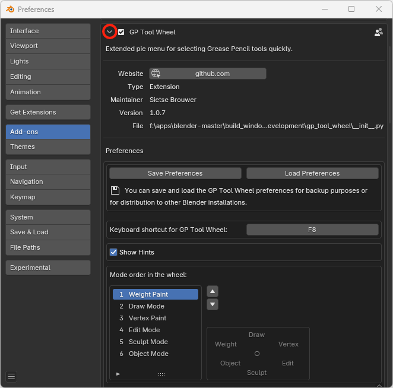

# GP Tool Wheel
*a Grease Pencil addon for [Blender](https://www.blender.org/) 3.0+ –– switch quickly between tools*

Using Grease Pencil and switching a lot between modes and tools? Then GP Tool Wheel can speed up your workflow: it combines mode and tool selection in one delicious wheel.

## How to use the wheel – press <kbd>F8</kbd>
By default you can invoke the tool wheel with the shortcut <kbd>F8</kbd>. You can change this shortcut easily by [customizing your wheel](#customize-your-wheel).

The wheel only appears when there is an active Grease Pencil object.

Selecting a tool needs no explanation: click on an icon and you are good to go.

> **Switching mode only:** Tap 1...6 on your keyboard. Or click near the colored dot in the center space of the wheel.
> 
> 

## Customize your wheel
For the add-on preferences, go to `Edit` > `Preferences...` > `Add-ons` and look for `3D View: GP Tool Wheel`. Click on the arrow on the left.

Here you can compose your ideal, tailor made wheel. Perhaps you want to change it in a kind of 'Quick favorites' menu, with only the modes and tools you often use. Or assign <kbd>Tab</kbd> as shortcut, replacing the default pie menu.

> **Circle of GP life:** defining the order of modes
>
> 

> **Don't show what you don't need:** selecting your favorite tools
> 
> 

> **Transfer preferences to other computer or Blender installation:**
> you can save the preferences to a `wheel_definition.json` file and distribute that file to other computers or Blender installations.
> The file will be saved in the add-on installation directory. Copy this file to the add-on directory of other computers and the preferences will be loaded automatically at startup.
> 
> 

## Installation
GP Tool Wheel is suited for Blender 3.0 and higher.

Installation of the add-on is done in the usual Blender way:
- Download [the latest release](https://github.com/SietseB/GP-Tool-Wheel/releases). (Make sure it is a zip file, not automatically unzipped.)
- In Blender, go to `Edit` > `Preferences...` > `Add-ons`. Click on `Install...` and select the zip file.
- When the stars are in your favour, the add-on appears. Activate it.
- And since you are here: click on the add-on arrow and take a look at the preferences straight away.

## Having issues? Or wishes?
[Create a ticket](https://github.com/SietseB/GP-Tool-Wheel/issues) and I'll see what I can do.

## Changelog
- v1.0.2 – 2023-02-07
  - Default keyboard shortcut changed to F8
- v1.0.1 – 2023-01-02
  - Code cleanup
- v1.0.0 – 2022-11-16
  - Initial release
