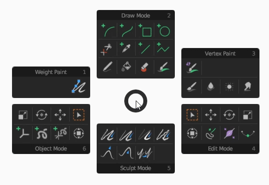
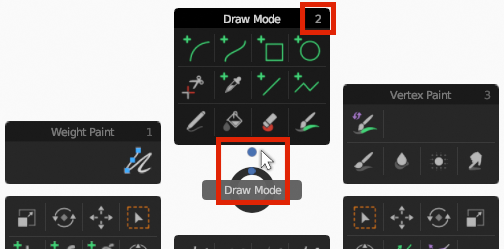
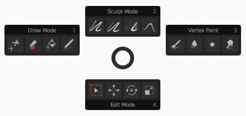

# GP Tool Wheel
*a Grease Pencil addon for [Blender](https://www.blender.org/) 3.0+ –– switch quickly between tools*

Using Grease Pencil and switching a lot between modes and tools? Then GP Tool Wheel can speed up your workflow: it combines mode and tool selection in one delicious wheel.

## How to use the wheel
By default you can invoke the tool wheel with the pie menu shortcut: `Tab` or `Ctrl`-`Tab`. You can change this shortcut easily, by [customizing your wheel](#customize-your-wheel).

Selecting a tool doesn't need an explanation: click on an icon and you are good to go.

> **Neat detail:** you don't *have* to select a tool. When clicking *outside* the active mode panel (marked with the colored dot), you just switch modes. Like you would with the default pie menu.
> 
> 

## Customize your wheel
For the add-on preferences, go to `Edit` > `Preferences...` > `Add-ons` and look for `3D View: GP Tool Wheel`. Click on the arrow on the left.

Here you can compose your ideal, tailor made wheel. Perhaps you want to change it in a kind of 'Quick favorites' menu, with only the modes and tools you often use.

It's recommended to change the keyboard shortcut when you don't include all the modes in your wheel.

> **Circle of GP life:** defining the order of modes
>
> 

> **Don't show what you don't need:** selecting your favorite tools
> 
> 

> **Example of customized wheel:**
>
> 

## Installation
GP Tool Wheel is suited for Blender 3.0 and higher.

Installation of the add-on is done in the usual way:
- Download [the latest release](https://github.com/SietseB/GP-Tool-Wheel/releases/tag/v1.0.0). (Make sure it is a zip file, not automatically unzipped.)
- In Blender, go to `Edit` > `Preferences...` > `Add-ons`. Click on `Install...` and select the zip file.
- When the stars are in your favour, the add-on appears. Activate it.
- And since you are here: click on the add-on arrow and take a look at the preferences straight away.

## Having issues? Or wishes?
[Create a ticket](https://github.com/SietseB/GP-Tool-Wheel/issues) and I'll see what I can do.

## Changelog
- v1.0.0 – 2022-11-10
  - Initial release
